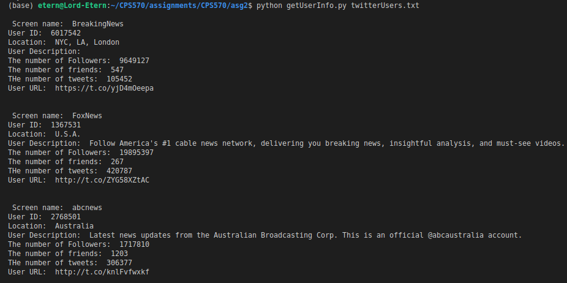
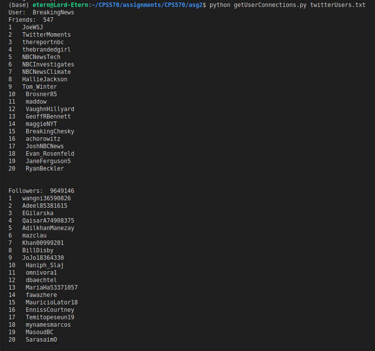
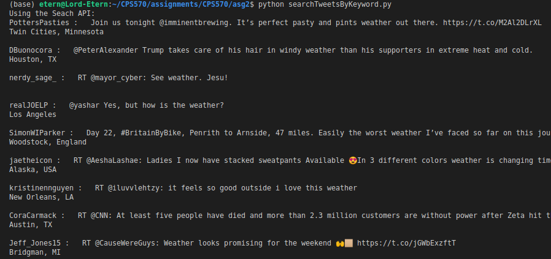
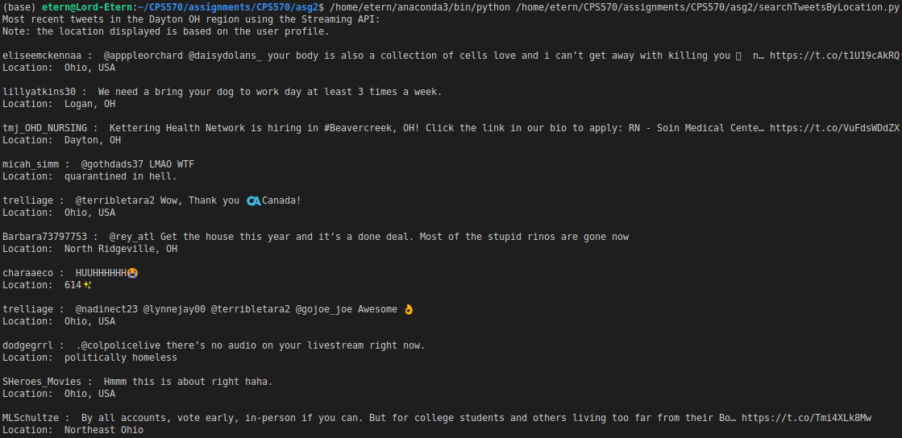

## Author:
* Samuel Akpan

## Requirements:
* python 2/3
* Tweepy
# Installation:
Linux/Mac
```
$ git clone https://github.com/tweepy/tweepy.git
$ pip install tweepy
```

## Usage:

The Programs were written with different files according to each question. Some of the files require a commandline argument and can be run as demonstrated below.

Use the followings command to run the code:
#### 1

```
 p ython getUserInfo.py twitterUsers.txt //or any list of users you might have
```

### 2
```
$ python getUserConnections.py twitterUsers.txt
```
## 3a
```
$ python searchTweetsByKeyword.py 
```

### 3b
```
$ python searchTweetsByLocation.py 
```
## Output Sample:






## Lessons
Using Tweepy to access the twitter API for basic crawling
Using Twitter APIs:
* REST APIs
* Streaming APIs
* Search API
 


