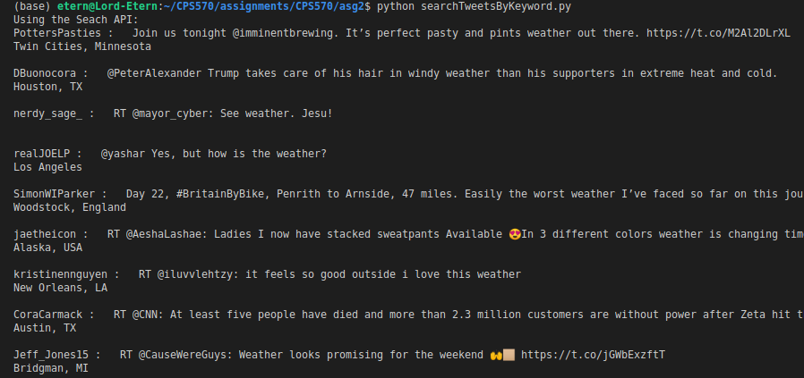
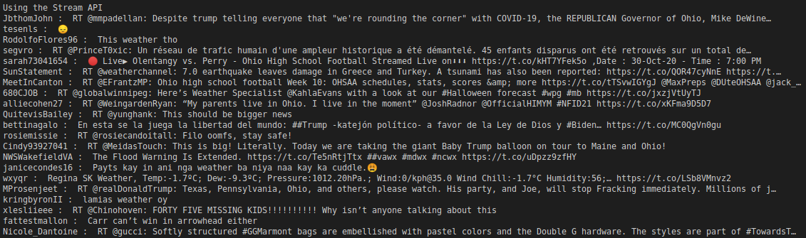
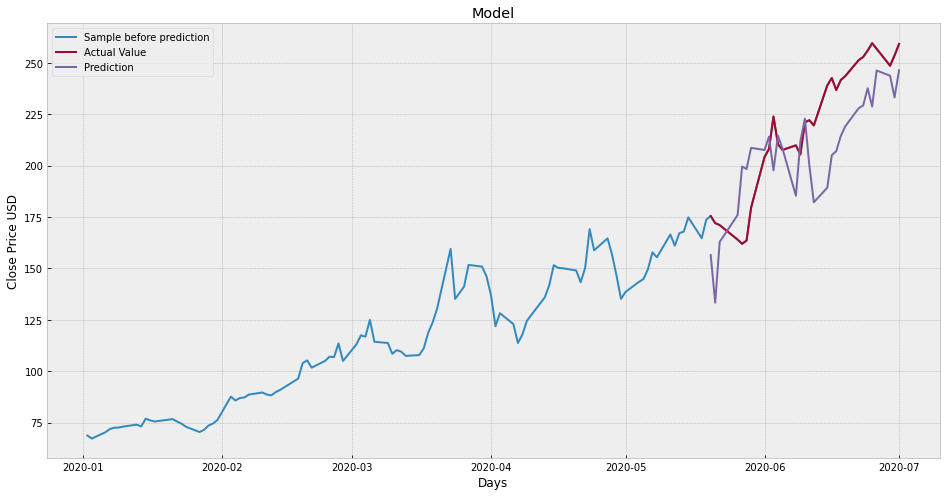

## Author:
* Samuel Akpan

## Requirements:
* python 2/3
* Tweepy
* numpy
* Pandas
* sklearn 
* matplotlib 
* (May also require python-tk if not already installed)

## Installation:
Linux/Mac
```
$ git clone https://github.com/tweepy/tweepy.git
$ pip install {tweepy, numpy, pandas, sklearn, matplotlib}
```

## Usage:

The Programs were written with different files according to each question. Some of the files require a commandline argument and can be run as demonstrated below.

Use the followings command to run the code:
1. This program takes a list of user's screen names and provides  basic infomation about the user's profile. 
```
 p ython getUserInfo.py twitterUsers.txt //or any list of users you might have
```
2. This program displays a the friends and followers of a given list of user's screen names
```
$ python getUserConnections.py twitterUsers.txt
```
3. (Part a) Given specific keywords, this program obtains the first 50 tweets contaning those words.
```
$ python searchTweetsByKeyword.py 
```
3. (Part b) This program obtains the first 50 tweets found within the Dayton region. 
```
$ python searchTweetsByLocation.py 
```
4. The program here is a simple program that obtains the stock price (close) of a company in this case (Zoom) over a 7 month period, then predicts the stock price of the next 30 days. Finally, the graph displayed contains the predicted price and the eventual stock price for the given time period. 
To see the program run more procedurally, see  ` simple_stock_predictor.pdf `

```
$ python simple_stock_predictor.py
```

## Output Sample:







## Lessons
Using Tweepy to access the twitter API for basic crawling.
Using Twitter APIs:
* REST APIs
* Streaming APIs
* Search API

## To Do
Optimise program efficiency and reduce complexity.

 


